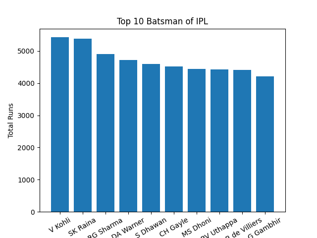
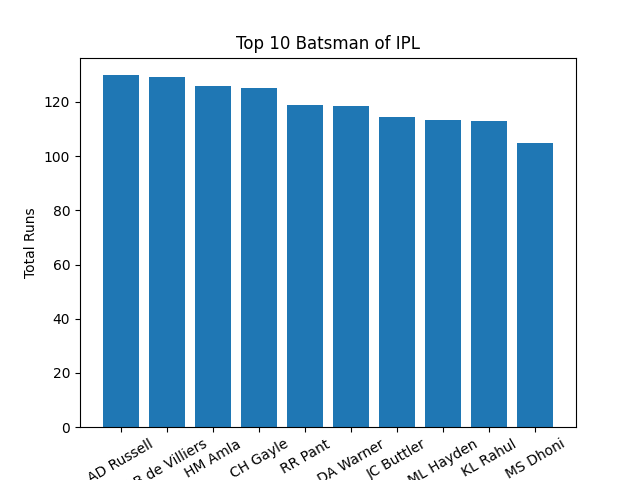
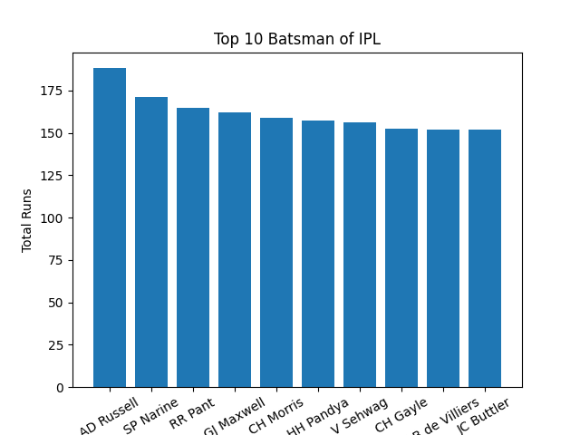
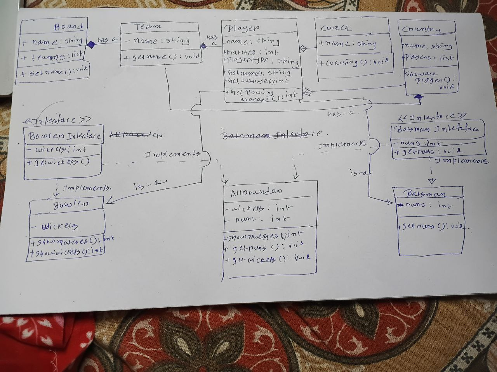

# 🏏 IPL Cricket Data Analysis & OOP Simulation  

This project combines **Python-based data analysis** with **Java OOP design & UML modeling** to analyze IPL (Indian Premier League) cricket datasets and simulate player-team relationships using Object-Oriented Programming principles.  

---

## 📌 Project Overview  

The project is divided into two main parts:  

1. **Data Analysis (Python + SQL + Visualization)**  
   - Fetches IPL datasets using **DuckDB (SQL)** and **Python (NumPy, Pandas)**.  
   - Preprocesses player and match statistics.  
   - Visualizes top-performing players with graphs.  

2. **OOP Simulation (Java + UML + Threading)**  
   - Implements cricket entities like **Player, Batsman, Bowler, Allrounder, Team, Coach, Country, Board**.  
   - Demonstrates **OOP concepts**: Inheritance, Interfaces, Aggregation, Composition, and Association.  
   - Includes **Threading examples** to simulate independent cricket-related tasks.  
   - UML/ER diagrams showing entity relationships.  

---

## 📊 Dataset  

Datasets are sourced from [Kaggle IPL Dataset](https://www.kaggle.com/datasets/ramjidoolla/ipl-data-set?select=most_runs_average_strikerate.csv).  

**Files in `/datasets`:**  
- `deliveries.csv`  
- `matches.csv`  
- `most_runs_average_strikerate.csv`  
- `Players.csv`  
- `Players.xlsx`  
- `teams.csv`  
- `teamwise_home_and_away.csv`  
- `dataset link.txt` (source link)  

---

## 📂 Project Structure  

```
📦 IPL-Cricket-Analysis  
│── datasets/  
│   ├── deliveries.csv  
│   ├── matches.csv  
│   ├── Players.csv  
│   ├── teams.csv  
│   └── ...  
│  
│── images/  
│   ├── top_10_batsman.png  
│   ├── top_10_consistent.png  
│   ├── top_10_hitter.png  
│   ├── uml_diagram.png  
│  
│── oops/  
│   └── java_project/  
│       ├── PlayerDemo.java  
│       ├── TeamDemo.java  
│       ├── CoachDemo.java  
│       ├── Batsman.java  
│       ├── Bowler.java  
│       ├── Allrounder.java  
│       ├── BoardDemo.java  
│       ├── Country.java  
│       ├── IPL.java (main class)  
│       └── ThreadingExample.java  
│  
│── data_fetch_by_sql.py  
│── data_preprocessing.py  
│── data_visual_analysis.py  
│── players_data_preprocessing.py  
│── README.md  
```  

---

## ⚙️ Technologies Used  

- **Python**: NumPy, Pandas, Matplotlib, DuckDB  
- **Java**: OOP (Inheritance, Interfaces, Aggregation, Composition, Association), Threading  
- **SQL**: DuckDB (querying datasets)  
- **Visualization**: Matplotlib graphs  

---

## 🔗 ER / UML Diagram  

The project includes UML & ER diagrams that illustrate:  
- **Aggregation** → `Team` ⟶ `Players`  
- **Composition** → `Board` ⟶ `Team`  
- **Association** → `Player` ↔ `Coach`  
- **Inheritance & Interfaces** → `Player` → `Batsman`, `Bowler`, `Allrounder`  

📌 Diagram file: `images/uml_diagram.png`  

---

## 🚀 How to Run  

### 1. Python (Data Analysis)  
```bash
# Install dependencies
pip install pandas numpy matplotlib duckdb

# Run preprocessing
python data_preprocessing.py

# Run SQL fetch
python data_fetch_by_sql.py

# Run visual analysis
python data_visual_analysis.py
```  

### 2. Java (OOP Simulation)  
```bash
# Navigate to OOP project folder
cd oops/java_project

# Compile all classes
javac *.java

# Run main IPL simulation
java IPL
```  

---

## 📈 Features  

- ✅ Fetch & preprocess IPL datasets  
- ✅ Visualize top batsmen, consistent players, big hitters  
- ✅ Implement cricket OOP model with UML  
- ✅ Demonstrate Aggregation, Composition, Association, Inheritance  
- ✅ Use SQL (DuckDB) for querying CSV datasets  
- ✅ Threading in Java for independent cricket tasks  

---

## 🔮 Future Scope  

- Add **Machine Learning models** to predict player performance  
- Expand **SQL queries** for deeper match analysis  
- Enhance **Java simulation** with real match simulations  
- Integrate project into a **full-stack web application**  

---

## 📷 Sample Outputs  

| Top 10 Batsmen | Top 10 Consistent Players |Top 10 Hitter Batsman |  UML Diagram |
|----------------|--------------------------|-------------|---------------|
|  |  |  |  |

---

✨ **Developed with Python, Java & SQL for Cricket Analytics and OOP Simulation.**  
